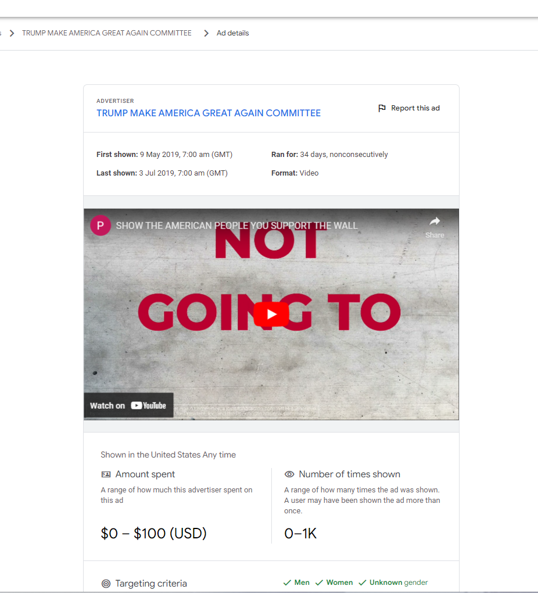
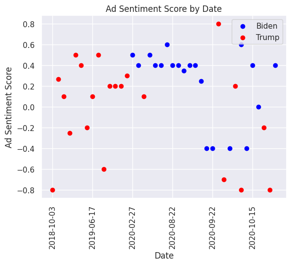

```{r setup, include=FALSE}
knitr::opts_chunk$set(echo = TRUE)
```

```{r, echo=FALSE, warning=FALSE,  message=FALSE}

library(readr)
us_biden_trump_video_text_sent <- 
  read_csv("../data/data_processed/us_biden_trump_video_text_sent.csv")

```

# Introduction

The utilization of political advertisements on online platforms has become increasingly prevalent in recent years. In this study, we analyze a dataset containing all political ads that have been displayed on Google platforms in the United States since May 2018. The dataset includes information such as the advertiser, the days served, the targeting criteria employed, the ad spend, and the impressions. Our objective is to explore the sentiment difference between Trump and Biden advertisements using GPT-3.5 Turbo as our sentiment analyzer.

# Methods

To obtain the youtube URLs for each advertisement in our dataset, we employed an RSelenium webscraping script. The script was designed to operate in a sophisticated manner by initiating a headless browser via a Selenium server, which was based on a running Docker container. The script subsequently selected a random sample of 16 rows and instructed Selenium to retrieve the youtube URLs, which were then stored in an Rds file.

Subsequently, we filtered the advertisements to include only those from advertisers whose names contained either "Trump" or "Biden" and randomly selected 25 advertisements from each group. To transcribe the audio of these advertisements, we utilized Google Colab. Google Colab was selected due to its capacity to provide a workspace for running processes on a GPU at no cost. This was particularly advantageous as the OpenAI Whisper Transcription model necessitates substantial computing power. Additionally, the OpenAI interface is more readily accessible for Python than for R, which explains our transition to Python for this portion of the analysis.

Utilizing Google Colab and the yt-dlp package, we downloaded only the audio of each youtube video and transcribed it using the OpenAI Whisper Transcription model. Owing to the GPU, the transcription of 50 advertisements with the assistance of the "large" Whisper model required approximately 4 minutes.

The term "large language models" (LLM) refers to neural networks with a lot of parameters that have been trained on a lot of material. It has been demonstrated that LLMs excel at a number of different tasks, including sentiment analysis. LLMs are able to precisely identify the sentiment included in text because of their capacity to handle enormous amounts of data. This is the reason why we wanted to test GPT-3.5 Turbo in our experiment as a sentiment analyzer. [@wu2023bloomberggpt]

{width="800"}  


# Results

We conducted sentiment analysis on the transcribed text using GPT-3.5 Turbo with a specific prompt:

```{python, eval = FALSE, warning = FALSE, message = FALSE}
prompt = f"""
        You are a Sentiment Analysis Expert in Political Advertising.
        What is the sentiment of the following Political Campaign Text?

        On a scale of -1 to 1, with -1 being negative and 1 being positive,
        please provide the sentiment
        score of the text as accurately as possible, including decimal points. 
        Reply without explanation, ONLY a single number!
        Your output shall never be exactly 0. It should at least indicate a number that's slightly
        positive or negative. Please be more sensitive to neutral texts and provide a score that reflects
        the overall sentiment of the text.

        Advertisement Text: '''{ad_text}'''
        """
```

We collected all sentiment scores and compared them between Trump and Biden advertisements. The average sentiment score for Biden advertisements was 0.248, while the average sentiment score for Trump advertisements was -0.036.

```{r, echo=FALSE, warning=FALSE,  message=FALSE}

library(dplyr)
library(knitr)

# Calculate the average ad_sentiment_score by ad_person
result <- us_biden_trump_video_text_sent %>%
  group_by(ad_person) %>%
  summarize(mean_ad_sentiment_score = mean(ad_sentiment_score))

# Rename the columns
colnames(result) <- c('Candidate', 'Sentiment Score')

# Export the result as a kable table with a title
kable(result, caption = 'Average Sentiment Score by Candidate')
```



A scatterplot visualization over time revealed a similar pattern. Although both candidates had positive advertisements, Biden never had a value below -0.4 while Trump had multiple values below -0.4, even hitting -0.8 three times.

# Conclusion

Using GPT-3.5 Turbo as our sentiment analyzer, our aim was to investigate the sentiment variance between the Trump and Biden adverts. According to our findings, the average sentiment score for Biden ads was greater than it was for Trump ads. A similar pattern was seen when a scatterplot was visualized over time.

These results shed light on the attitude portrayed in Trump and Biden's political advertising. The causes of these disparities in sentiment and their possible impact on public opinion could be explored in more detail through further research.

Our findings also indicate that it is possible to optimize our script for faster workflows and transcribe larger datasets. This provided us with an opportunity to see what is conceivable. Despite the fact that this was a small experiment, it yielded significant findings. Most importantly, it demonstrated that the workflow from webscraping to transcription was even possible. It is a relief to see that this approach could be utilized on a much larger scale for future research.

# References
